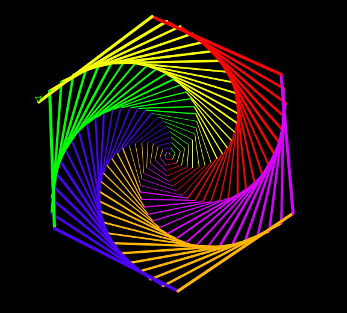
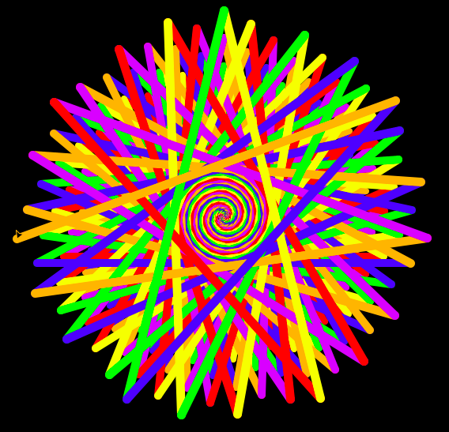
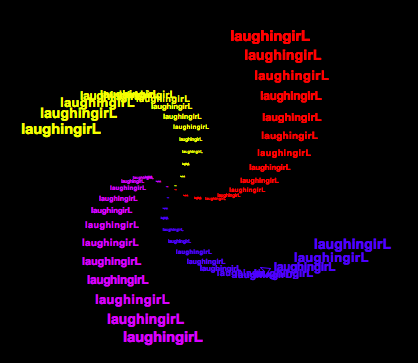

# README

## intricateTurtleScripts
---
### Examples
#### SquareSpiral1.py

#### SquareSpiral2.py

#### SquareSpiral3.py

---
### References
- [用python的turtle画炫酷的图](https://blog.csdn.net/qq_14961401/article/details/58595783)
- [使用python自动画一只小猪佩奇（源码）](https://blog.csdn.net/sinat_36184075/article/details/80357696)
- [python3 turtle 绘制哆啦A梦](https://blog.csdn.net/weixin_41977410/article/details/80615493)